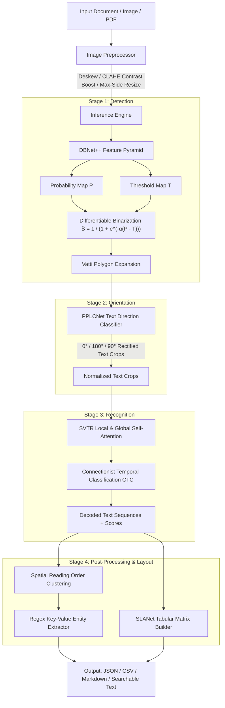

# ⚡ Enterprise PaddleOCR & PP-OCR Deep Neural System

[](https://www.python.org/downloads/)
[](https://fastapi.tiangolo.com)
[](https://github.com/PaddlePaddle/PaddleOCR)
[](LICENSE)
[](docker/Dockerfile)

> **Production-ready, industrial-grade Optical Character Recognition (OCR) and document intelligence platform** powered by the **PP-OCRv4 / PP-OCRv3** algorithm suite (Differentiable Binarization DBNet++, Direction Angle Classification, SVTR Vision Transformer, and SLANet Tabular Extraction).

---

## 📑 Table of Contents
- [Key Features](#-key-features)
- [Algorithmic Architecture & Deep Learning Breakdown](#-algorithmic-architecture--deep-learning-breakdown)
- [Directory Structure](#-directory-structure)
- [Quickstart Guide](#-quickstart-guide)
- [REST API Reference](#-rest-api-reference)
- [Interactive Web Studio](#-interactive-web-studio)
- [CLI Tool for Batch Processing](#-cli-tool-for-batch-processing)
- [Docker & Containerized Deployment](#-docker--containerized-deployment)
- [Comprehensive PDF Guide](#-comprehensive-pdf-guide)
- [Running Automated Tests](#-running-automated-tests)

---

## 🌟 Key Features

1. **Multi-Stage Neural Pipeline**:
   - **Text Detection**: DBNet++ (Differentiable Binarization with adaptive threshold maps and Vatti unclip expansion).
   - **Direction / Angle Classification**: PPLCNet-based orientation corrector for $0^\circ, 90^\circ, 180^\circ, 270^\circ$ scans.
   - **Text Recognition**: SVTR-LCNet (Single Visual Model for Text Recognition) with Connectionist Temporal Classification (CTC) decoding.
2. **PP-Structure & Tabular Reconstruction**:
   - Extraction of multi-row, multi-column tables into JSON, CSV, and Markdown.
   - Key-Value entity extraction (Invoices, Receipts, Dates, Totals, Tax IDs).
3. **High-Performance FastAPI Backend**:
   - Asynchronous endpoints for images, PDFs, structured entities, and tabular grids.
4. **Glassmorphic Interactive Web Studio**:
   - Live canvas bounding-box inspector with hover tooltips, confidence heatmaps, and one-click exports.
5. **Batch Processing CLI**:
   - Terminal runner with colored progress bars for processing single files or entire directory trees.
6. **Enterprise Ready**:
   - Dual CPU/GPU acceleration, multi-stage production Docker containers, and test suites.

---

## 🧠 Algorithmic Architecture & Deep Learning Breakdown



### Mathematical Formulation
- **Differentiable Binarization**:
  $$\hat{B}_{i,j} = \frac{1}{1 + \exp\left(-\alpha (P_{i,j} - T_{i,j})\right)}, \quad \alpha = 50$$
- **CTC Conditional Sequence Probability**:
  $$P(l|\mathbf{x}) = \sum_{\pi \in \mathcal{B}^{-1}(l)} \prod_{t=1}^T y_{\pi_t}^t$$

---

## 📂 Directory Structure

```
e:\OCR\
├── app\
│   ├── core\
│   │   ├── config.py             # Settings, model parameters, device detection
│   │   ├── preprocessor.py       # Deskewing, CLAHE, morphological filtering
│   │   ├── ocr_engine.py         # PaddleOCR / PP-OCR inference wrapper & fallback
│   │   ├── postprocessor.py      # Reading order sort, table reconstruction, regex
│   │   └── layout_engine.py      # Document sectioning & layout analyzer
│   ├── api\
│   │   ├── main.py               # FastAPI application & static mounting
│   │   ├── routes.py             # /ocr/image, /ocr/table, /ocr/structured, /health
│   │   └── schemas.py            # Pydantic schemas for requests and responses
│   ├── cli\
│   │   └── cli.py                # Batch OCR terminal tool
│   └── web\
│       ├── index.html            # Sleek Glassmorphic Web Dashboard
│       ├── css\style.css         # Modern dark-theme typography & animations
│       └── js\app.js             # Live bounding-box canvas inspector
├── docs\
│   ├── IMPLEMENTATION_PLAN.md    # Step-by-step roadmap from scratch to production
│   ├── ALGORITHM_DEEP_DIVE.md    # Detailed mathematical breakdown of DBNet & SVTR
│   ├── ARCHITECTURE.md           # System architecture & data flow
│   ├── API_DOCS.md               # Complete REST API reference
│   └── PP_OCR_Architecture_and_Algorithm_Guide.pdf # Publication-ready PDF guide
├── docker\
│   ├── Dockerfile                # Multi-stage CPU production image
│   ├── Dockerfile.gpu            # CUDA-accelerated image
│   └── docker-compose.yml        # Docker compose orchestrator
├── scripts\
│   ├── generate_pdf_guide.py     # ReportLab script generating the PDF guide
│   ├── download_models.py        # Model artifact pre-fetcher
│   ├── sample_generator.py       # Synthetic document & invoice generator
│   └── run_dev.py                # Single-command launch script
├── tests\
│   ├── test_engine.py            # OCR Engine & Postprocessor unit tests
│   ├── test_preprocessor.py      # Image enhancement unit tests
│   └── test_api.py               # FastAPI endpoint integration tests
├── requirements.txt              # Production dependencies
├── requirements-gpu.txt          # GPU dependencies
└── environment.yml               # Conda environment definition
```

---

## 🚀 Quickstart Guide

### 1. Environment Setup
```bash
# Clone and enter the workspace
git clone <your-repo-url>
cd OCR

# Create and activate Python 3.11 virtual environment
python -m venv .venv
# On Windows:
.venv\Scripts\activate
# On Linux/macOS:
source .venv/bin/activate

# Install dependencies
pip install -r requirements.txt
```

### 2. Launch Development Server
```bash
python scripts/run_dev.py
```
- **Web Studio**: [http://localhost:8000/](http://localhost:8000/)
- **Interactive Swagger Docs**: [http://localhost:8000/docs](http://localhost:8000/docs)
- **ReDoc API Spec**: [http://localhost:8000/redoc](http://localhost:8000/redoc)

---

## 🔌 REST API Reference

### 1. Process Single / Multi Image
`POST /api/v1/ocr/image`
```bash
curl -X POST "http://localhost:8000/api/v1/ocr/image" \
  -F "file=@sample_invoice.png" \
  -F "lang=en" \
  -F "preprocess=true"
```

### 2. Tabular Extraction (CSV / Markdown)
`POST /api/v1/ocr/table`
```bash
curl -X POST "http://localhost:8000/api/v1/ocr/table" \
  -F "file=@report_table.png"
```

### 3. Structured Key-Value Extraction
`POST /api/v1/ocr/structured`
```bash
curl -X POST "http://localhost:8000/api/v1/ocr/structured" \
  -F "file=@receipt.png"
```

---

## 🖥️ CLI Tool for Batch Processing

Process an entire directory of documents with a single command:
```bash
# Process directory and export all formats (TXT, JSON, CSV)
python -m app.cli.cli --input ./uploads --output ./outputs --lang en --format all
```

---

## 🐳 Docker & Containerized Deployment

### Launch with Docker Compose
```bash
docker-compose -f docker/docker-compose.yml up --build -d
```

---

## 📄 Comprehensive PDF Guide
A technical PDF guide has been generated:
- File location: [`docs/PP_OCR_Architecture_and_Algorithm_Guide.pdf`](docs/PP_OCR_Architecture_and_Algorithm_Guide.pdf)
- To re-generate at any time:
  ```bash
  python scripts/generate_pdf_guide.py
  ```

---

## 🧪 Running Automated Tests
```bash
pytest -v
```

---

## 📜 License
Licensed under the Apache 2.0 License.
