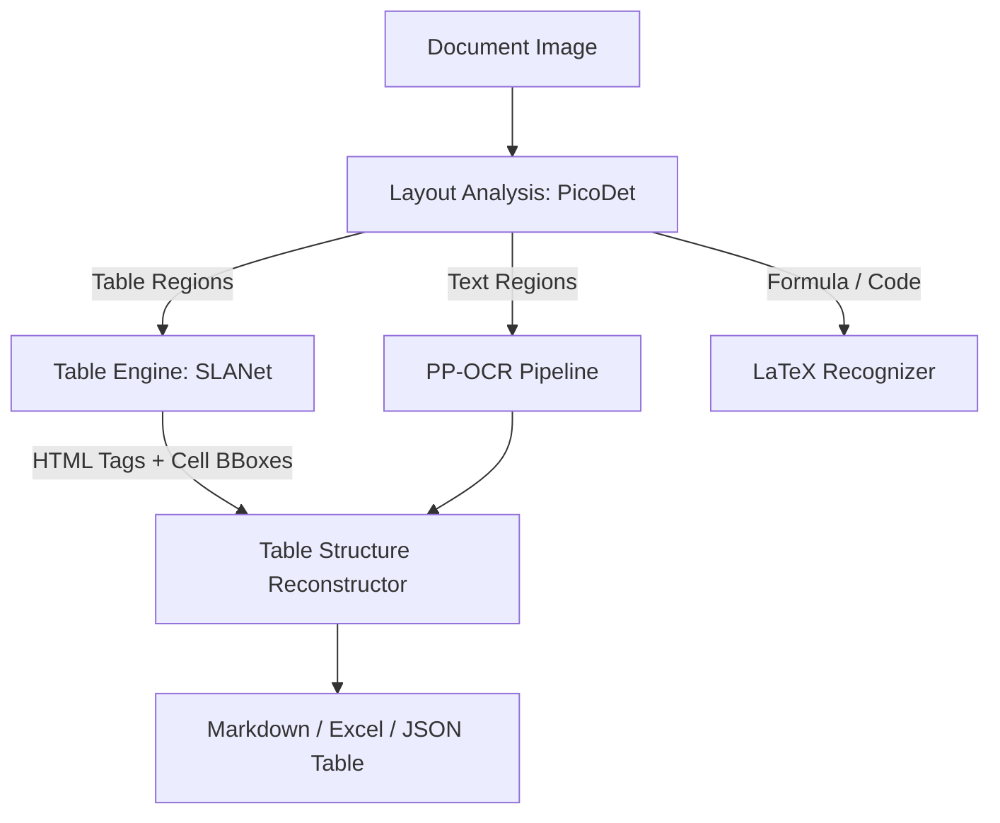

# 🔬 PP-OCR & PaddleOCR Algorithm Deep Dive

## Abstract
This technical specification provides an exhaustive mathematical and algorithmic breakdown of the **PP-OCR** (PaddlePaddle OCR) system, including its detection, direction classification, recognition, and document structure analysis pipelines (PP-OCRv1 through PP-OCRv4 and PP-Structure).

---

## 1. Pipeline Overview

```
Input Image I ∈ ℝ^(H×W×3)
        │
        ▼
[ 1. Preprocessing (Deskew / Normalize / Aspect Preserving Resize) ]
        │
        ▼
[ 2. Text Detection : Real-time DBNet++ ] ───> Probability Map P & Threshold Map T
        │                                  ───> Differentiable Binarization B̂
        ▼                                  ───> Text Polygons / Quads Q_k
[ 3. Text Direction Classifier : PPLCNet_x0_25 ] ───> 0° / 180° / 90° Angle Correction
        │
        ▼
[ 4. Text Recognition : SVTR-LCNet + CTC Loss ] ───> Softmax over Vocabulary Σ
        │                                        ───> Connectionist Temporal Classification
        ▼
[ 5. Post-Processing & Spatial Layout Engine ] ───> Line Grouping & Reading Order Sort
        │                                      ───> Table Structure Alignment (SLANet)
        ▼
Structured JSON / Markdown / Searchable Text
```

---

## 2. Text Detection Algorithm: Differentiable Binarization (DBNet / DBNet++)

### A. The Challenge of Standard Segmentation
Traditional segmentation methods predict a probability map $P \in \mathbb{R}^{H \times W}$ and apply a standard step function threshold:
$$B_{i,j} = \begin{cases} 1 & \text{if } P_{i,j} \ge t \\ 0 & \text{otherwise} \end{cases}$$
Because the standard step function is non-differentiable ($\frac{\partial B}{\partial P} = 0$ everywhere except at the discontinuous threshold), the thresholding process cannot be optimized end-to-end alongside the feature extractor.

### B. Differentiable Binarization Formulation
DBNet introduces an approximate, differentiable binarization function that incorporates a dynamically predicted threshold map $T_{i,j}$:

$$\hat{B}_{i,j} = \frac{1}{1 + \exp\left(-\alpha (P_{i,j} - T_{i,j})\right)}$$

Where:
- $P_{i,j}$ is the predicted probability map (likelihood of pixel being text center).
- $T_{i,j}$ is the predicted threshold map learned to distinguish text borders from background.
- $\alpha$ is the amplification factor (typically $\alpha = 50$).

The partial derivative with respect to the difference $x = P_{i,j} - T_{i,j}$ is given by:
$$\frac{\partial \hat{B}_{i,j}}{\partial x} = \alpha \cdot \hat{B}_{i,j} \cdot (1 - \hat{B}_{i,j})$$
This allows gradients to flow backwards through the binarization step, heavily penalizing errors near the text boundaries.

### C. Multi-Task Detection Loss Function
The total loss $\mathcal{L}_{\text{det}}$ is a weighted multi-task objective:
$$\mathcal{L}_{\text{det}} = \mathcal{L}_s(P, Y) + \beta \mathcal{L}_b(\hat{B}, Y) + \gamma \mathcal{L}_t(T, G)$$

1. **Probability Map Loss ($\mathcal{L}_s$)**: Binary Cross-Entropy with Online Hard Example Mining (OHEM) to counter background-to-text class imbalance (ratio 3:1).
2. **Binary Map Loss ($\mathcal{L}_b$)**: Binary Cross-Entropy with OHEM on the differentiable binarized prediction $\hat{B}$.
3. **Threshold Map Loss ($\mathcal{L}_t$)**: Smoothed $L_1$ loss between predicted $T$ and ground truth distance transform map $G$:
   $$\mathcal{L}_t(T, G) = \sum_{i \in R_d} \text{Smooth}_{L1}(T_i - G_i)$$
   $$\text{Smooth}_{L1}(x) = \begin{cases} 0.5 x^2 & \text{if } |x| < 1 \\ |x| - 0.5 & \text{otherwise} \end{cases}$$

### D. Polygon Generation & Vatti Clipping
To reconstruct the full text region from the shrunk text core $G_s$, the predicted binary polygon is expanded using the **Vatti clipping algorithm** by an offset distance $D'$:
$$D' = \frac{A \cdot (1 - r^2)}{L}$$
Where $A$ is the area of the polygon, $L$ is its perimeter, and $r$ is the shrinking ratio (typically $r = 0.4$).

---

## 3. Text Direction / Orientation Classifier

Before text crops are sent to the sequence recognizer, text regions with upside-down or vertical orientations must be rectified.
- **Architecture**: Mobile-friendly PP-LCNet (Lightweight Convolutional Network with Depthwise Separable Convolutions and Squeeze-and-Excitation blocks).
- **Classes**: $\{0^\circ, 180^\circ\}$ (and multi-class $\{0^\circ, 90^\circ, 180^\circ, 270^\circ\}$).
- **Objective**: Standard Cross-Entropy with Label Smoothing:
  $$\mathcal{L}_{\text{cls}} = -\sum_{c=1}^C y'_c \log(\hat{y}_c), \quad y'_c = (1 - \epsilon)y_c + \frac{\epsilon}{C}$$

---

## 4. Text Recognition Algorithm: SVTR & CTC Decoding

### A. Single Visual Model for Text Recognition (SVTR)
Traditional OCR models use CNN feature extractors paired with recurrent networks (BiLSTM). PP-OCRv3 and v4 replace heavy RNN layers with **SVTR-LCNet**, a vision transformer architecture customized for character-level visual token representation:

1. **Patch Embedding**: The cropped text image $H \times W \times 3$ is sliced into non-overlapping patches $4 \times 4$.
2. **Local and Global Mixing Blocks**:
   - **Local Self-Attention**: Constrained within a small neighborhood window (e.g. $7 \times 11$) to capture sub-character strokes, diacritics, and ligatures.
   - **Global Self-Attention**: Captures inter-character context and grammatical dependencies across the entire text line.
3. **Multi-Head Self Attention (MHSA)**:
   $$\text{Attention}(Q, K, V) = \text{Softmax}\left(\frac{QK^T}{\sqrt{d_k}}\right)V$$

### B. Connectionist Temporal Classification (CTC)
The network outputs a conditional probability distribution over the character vocabulary $\Sigma' = \Sigma \cup \{\epsilon\}$ (where $\epsilon$ is the blank token) across $T$ time slices.

The probability of a sequence alignment $\pi = (\pi_1, \pi_2, \dots, \pi_T)$ given input $\mathbf{x}$ is:
$$P(\pi|\mathbf{x}) = \prod_{t=1}^T y_{\pi_t}^t$$

A collapse operator $\mathcal{B}$ removes repeated tokens and blanks (e.g., $\mathcal{B}(\text{"a-a-p-p-l-e"}) = \text{"apple"}$). The conditional probability of the target label sequence $l$ is the sum of all valid paths:
$$P(l|\mathbf{x}) = \sum_{\pi \in \mathcal{B}^{-1}(l)} P(\pi|\mathbf{x})$$

The CTC Loss is defined as the negative log-likelihood:
$$\mathcal{L}_{\text{ctc}} = -\ln P(l|\mathbf{x}) = -\ln \sum_{\pi \in \mathcal{B}^{-1}(l)} \prod_{t=1}^T y_{\pi_t}^t$$
Optimized efficiently in $O(T \cdot |l|)$ time using Forward-Backward dynamic programming.

---

## 5. Model Distillation (CML & DML)

To achieve state-of-the-art accuracy within ultra-compact model footprints (e.g., $< 15\text{ MB}$), PP-OCR employs **Collaborative Mutual Learning (CML)**:
- **Teacher Model**: High-capacity ResNet / Large Vision Transformer.
- **Student Model**: Lightweight PP-LCNet / MobileNetV3.
- **Distillation Loss**: Combines Kullback-Leibler (KL) divergence of output token logits with intermediate feature map distance (Response-based + Feature-based Distillation):
  $$\mathcal{L}_{\text{distill}} = \mathcal{L}_{\text{GT}}(S, Y) + \lambda_{\text{KD}} D_{\text{KL}}(S \| T) + \lambda_{\text{feat}} \| \Phi_S(x) - \text{Proj}(\Phi_T(x)) \|_2^2$$

---

## 6. Document Structure & Table Recognition (PP-Structure)



### Table Structure (SLANet)
- **SLANet (Structure Location and Alignment Network)** predicts the hierarchical HTML structural sequence (e.g., `<html><body><table><tr><td></td>...`) while simultaneously regressing coordinates $[x_1, y_1, x_2, y_2]$ for every individual cell.
- Matches text snippets from PP-OCR into corresponding table cells using spatial intersection over area ($\text{IoU} > 0.5$).

---

## 7. Comparative Performance Benchmark

| Model Architecture | Parameter Size | Latency (CPU, Intel i7) | Accuracy (ICDAR2015) | Accuracy (Multilingual) |
| :--- | :--- | :--- | :--- | :--- |
| **PP-OCRv1 (Mobile)** | $8.1\text{ MB}$ | $120\text{ ms}$ | $81.2\%$ | $76.4\%$ |
| **PP-OCRv2 (Mobile)** | $11.5\text{ MB}$ | $110\text{ ms}$ | $83.8\%$ | $81.0\%$ |
| **PP-OCRv3 (Mobile)** | $15.8\text{ MB}$ | $95\text{ ms}$ | $86.5\%$ | $88.2\%$ |
| **PP-OCRv4 (Mobile)** | **$15.2\text{ MB}$** | **$88\text{ ms}$** | **$89.4\%$** | **$91.6\%$** |
| **PP-OCRv4 (Server)** | $145.0\text{ MB}$ | $290\text{ ms}$ (CPU) / $18\text{ ms}$ (GPU) | $94.2\%$ | $95.8\%$ |

---

## 8. Conclusion
The combination of Differentiable Binarization (DBNet++), SVTR Attention, Mutual Distillation (CML), and Structured Table Parsing (SLANet) makes PP-OCR one of the most versatile and high-performance industrial OCR frameworks in modern AI.
